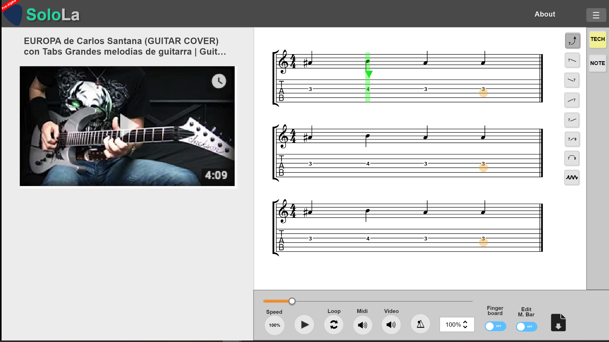

# Soloroom-frontend
Simplify guitar transcription process and accelerate it with guitar auto-transcription algorithm [solola](https://github.com/SoloLa-Platform/solola).



[](https://circleci.com/gh/SoloLa-Platform/soloroom-frontend)

[](https://gitter.im/SoloLa-Platform/community?utm_source=badge&utm_medium=badge&utm_campaign=pr-badge)

## Contribution Guide
This is internal project.
You can check out our [trello kanban](https://trello.com/b/eBcjm7aR/solola-project) as well.
If you are interested in this project, please contact to us by gitter.

- [contribution guide](https://docs.google.com/presentation/d/1t0PG1EsqxYCoxyMyXCvk2iCRAUM4ifz_dID6LN0kqPo/edit?usp=sharing)
- [naming rule & coding standard](https://docs.google.com/document/d/1xTRn0bZUWiJjJqK6Ds1CsQ246SY1iHQQj2xk-Schieg/edit)

## Project Structure

- src
  - assets (image/svg/other static files)
  - components
  - pages (SPA per component)
  - store (Vuex store)
  - utilities (others)
  - services (stay alone API)

## Prerequisite

- [yarn](https://yarnpkg.com/lang/en/docs/install/)

## Project setup
```
yarn install
```

### Compiles and hot-reloads for development
```
yarn run serve
```

### Compiles and minifies for production
```
yarn run build
```

### Run your tests
```
yarn run test
```

### Lints and fixes files
```
yarn run lint
```

### Run your unit tests
```
yarn run test:unit
```

### Customize configuration
See [Configuration Reference](https://cli.vuejs.org/config/).
